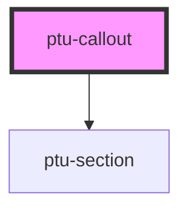

# ptu-callout

<!-- Auto Generated Below -->

## Properties

| Property      | Attribute      | Description | Type     | Default     |
| ------------- | -------------- | ----------- | -------- | ----------- |
| `dialingCode` | `dialing-code` |             | `string` | `"+44"`     |
| `localNumber` | `local-number` |             | `string` | `undefined` |

## Dependencies

### Depends on

- [ptu-section](../ptu-section)

### Graph

----------------------------------------------

*Built with [StencilJS](https://stenciljs.com/)*
