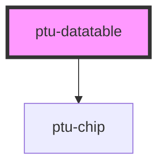

# ptu-datatable

<!-- Auto Generated Below -->

## Properties

| Property               | Attribute | Description | Type     | Default     |
| ---------------------- | --------- | ----------- | -------- | ----------- |
| `caption` _(required)_ | `caption` |             | `string` | `undefined` |

## Dependencies

### Depends on

- [ptu-chip](../ptu-chip)

### Graph

----------------------------------------------

*Built with [StencilJS](https://stenciljs.com/)*
