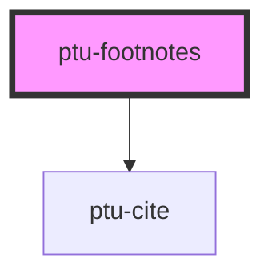

# ptu-footnotes

<!-- Auto Generated Below -->

## Properties

| Property         | Attribute         | Description | Type     | Default  |
| ---------------- | ----------------- | ----------- | -------- | -------- |
| `parentSelector` | `parent-selector` |             | `string` | `"body"` |

## Dependencies

### Depends on

- [ptu-cite](../ptu-cite)

### Graph

----------------------------------------------

*Built with [StencilJS](https://stenciljs.com/)*
