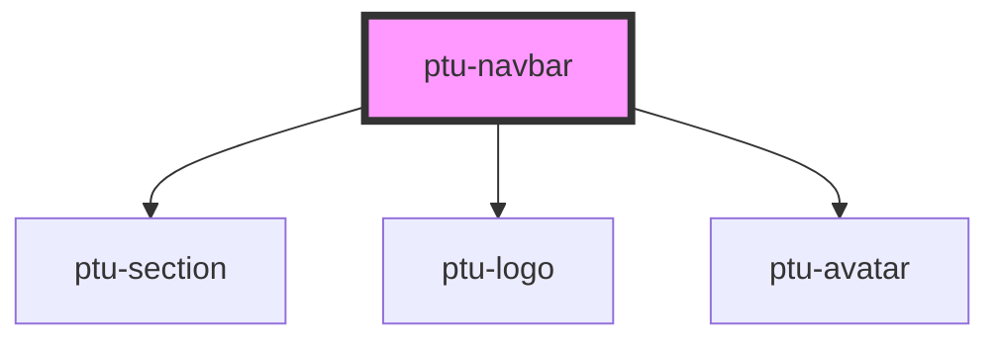

# ptu-navbar

<!-- Auto Generated Below -->

## Properties

| Property    | Attribute    | Description | Type                | Default |
| ----------- | ------------ | ----------- | ------------------- | ------- |
| `avatarUrl` | `avatar-url` |             | `boolean \| string` | `false` |
| `showApps`  | `show-apps`  |             | `boolean`           | `false` |
| `userName`  | `user-name`  |             | `boolean \| string` | `false` |

## Dependencies

### Depends on

- [ptu-section](../ptu-section)
- [ptu-logo](../ptu-logo)
- [ptu-avatar](../ptu-avatar)

### Graph

----------------------------------------------

*Built with [StencilJS](https://stenciljs.com/)*
