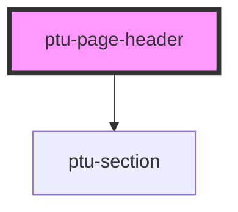

# ptu-page-header

<!-- Auto Generated Below -->

## Properties

| Property         | Attribute         | Description | Type                                                 | Default     |
| ---------------- | ----------------- | ----------- | ---------------------------------------------------- | ----------- |
| `category`       | `category`        |             | `string`                                             | `undefined` |
| `categoryColour` | `category-colour` |             | `"accent" \| "blue" \| "green" \| "red" \| "yellow"` | `"red"`     |
| `categoryHref`   | `category-href`   |             | `string`                                             | `undefined` |
| `headline`       | `headline`        |             | `string`                                             | `undefined` |
| `topic`          | `topic`           |             | `string`                                             | `undefined` |
| `topicHref`      | `topic-href`      |             | `string`                                             | `undefined` |

## Dependencies

### Depends on

- [ptu-section](../ptu-section)

### Graph

----------------------------------------------

*Built with [StencilJS](https://stenciljs.com/)*
