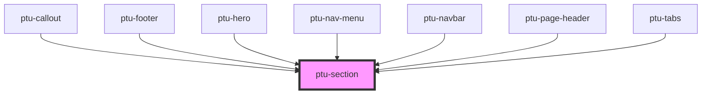

# ptu-section

<!-- Auto Generated Below -->

## Properties

| Property  | Attribute | Description | Type                          | Default  |
| --------- | --------- | ----------- | ----------------------------- | -------- |
| `sidebar` | `sidebar` |             | `"left" \| "none" \| "right"` | `"none"` |

## Dependencies

### Used by

 - [ptu-callout](../ptu-callout)
 - [ptu-footer](../ptu-footer)
 - [ptu-hero](../ptu-hero)
 - [ptu-nav-menu](../ptu-nav-menu)
 - [ptu-navbar](../ptu-navbar)
 - [ptu-page-header](../ptu-page-header)
 - [ptu-tabs](../ptu-tabs)

### Graph

----------------------------------------------

*Built with [StencilJS](https://stenciljs.com/)*
